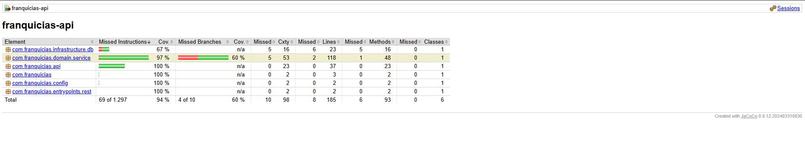
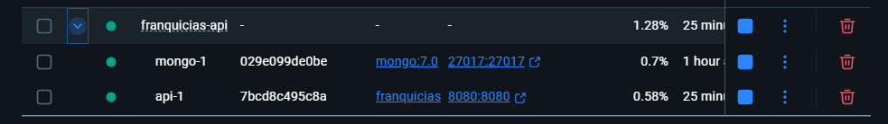

# Franquicias API

**Prueba tecnica**: API reactiva construida con Spring Boot WebFlux y MongoDB, usando arquitectura hexagonal.

---

## Descripción

Esta aplicacion gestiona una colección de **franquicias**, cada una con multiples **sucursales**, y cada sucursal con multiples **productos** que tienen un nombre y una cantidad de stock.

**Tecnologías**:
- Java 21, Spring Boot 3.4.5, Spring WebFlux  
- MongoDB (Persistencia reactiva)  
- ModelMapper para mapeo de entidades  
- Docker y Docker Compose  
- Lombok, Reactor  
- Swagger (springdoc-openapi)

---

## Arquitectura y decisiones de diseño

1. **Hexagonal / Clean Architecture**:  
   - `com.franquicias.domain` (Modelos, casos de uso / servicios)  
   - `com.franquicias.infrastructure` (Adaptadores de MongoDB, repositorios)  
   - `com.franquicias.api` (Controladores REST, DTOs)

2. **Reactividad**:  
   - Uso de Spring WebFlux y `reactor-core` para flujos no bloqueantes.  
   - Operadores `map`, `flatMap`, `switchIfEmpty` y manejo de señales `onNext`, `onError`, `onComplete`.  
   - ReactiveMongoRepository para acceso a datos.

3. **ModelMapper**:  
   - Bean global configurado para convertir entidades Mongo a modelos de dominio y viceversa.

4. **Logging**:  
   - Uso de `slf4j` a través de Lombok `@Slf4j` en servicios, controladores y adaptadores.

5. **Validación**:  
   - Validaciones `@Valid` y `@NotBlank` en DTOs.  
   - Excepciones `ResponseStatusException` para errores HTTP.

---

## Requisitos previos

- JDK 21  
- Maven 3.8+  
- Docker & Docker Compose (opcional para contenedores)  

---

## Ejecución local (sin Docker)

1. Clonar el repositorio:
   ```bash
   git clone https://github.com/tu-usuario/franquicias-api.git
   cd franquicias-api
   ```

2. Ejecutar con Maven:
   ```bash
   mvn clean spring-boot:run
   ```

3. Acceder a la API en `http://localhost:8080`  
   Swagger UI: `http://localhost:8080/swagger-ui.html`

> **Nota**: Deben tener MongoDB corriendo en `localhost:27017`, base de datos `franquicias`.

---

## Ejecución con Docker Compose

1. Construir el JAR:
   ```bash
   mvn clean package -DskipTests
   ```

2. Levantar Mongo y la API:
   ```bash
   docker compose up --build
   ```

3. Swagger UI: `http://localhost:8080/swagger-ui.html`

---

## Endpoints disponibles

Todos los endpoints devuelven y reciben **JSON**.

| Método | Ruta                                                   | Descripción                                 |
|--------|--------------------------------------------------------|---------------------------------------------|
| POST   | `/franchises`                                          | Crear nueva franquicia                      |
| GET    | `/franchises`                                          | Obtener todas las franquicias               |
| GET    | `/franchises/{fid}`                                    | Obtener franquicia por ID                   |
| POST   | `/franchises/{fid}/branches`                           | Agregar sucursal a franquicia               |
| POST   | `/franchises/{fid}/branches/{bid}/products`            | Agregar producto a sucursal                 |
| DELETE | `/franchises/{fid}/branches/{bid}/products/{pid}`      | Eliminar producto de sucursal               |
| PATCH  | `/franchises/{fid}/branches/{bid}/products/{pid}/stock`| Actualizar stock de producto                 |
| GET    | `/franchises/{fid}/top-stock`                         | Top stock por franquicia                    |
| PATCH  | `/franchises/{fid}`                                    | Renombrar franquicia                        |
| PATCH  | `/franchises/{fid}/branches/{bid}`                     | Renombrar sucursal                          |
| PATCH  | `/franchises/{fid}/branches/{bid}/products/{pid}`      | Renombrar producto                          |

---

## Pruebas unitarias

- Ejecutar:
  ```bash
  mvn test
  ```
- Cobertura con JaCoCo:
  ```bash
  mvn jacoco:report
  ```
- Ver informe HTML en `target/site/jacoco/index.html`.
   Comando: explorer.exe .\target\site\jacoco\index.html


---

## Comandos Docker

- Construir imagen:
  ```bash
  docker compose build api
  ```
- Levantar contenedores:
  ```bash
  docker compose up -d
  ```
- Ver logs:
  ```bash
  docker compose logs -f
  ```



---

## Versionado y despliegue

- **v1.0**: Endpoints basicos.  
- **v1.1-docker**: Empaquetado Docker
- **v1.2-rename**: Endpoints PATCH rename  
- **v1.4-readme**: Documentacion completa
- **v1.5-readme**: Cobertura del 80% e informe JaCoCo incluido
- **v1.6-readme**: MongoDb_Atlas

---

## Consideraciones de diseño y finales

1. **Reactividad y back-pressure**: con WebFlux y Reactor, el servidor maneja peticiones sin bloquear hilos, escalando eficazmente bajo carga alta.  
2. **Clean Architecture**: separa claramente dominio (modelos y servicios), infraestructura (adaptadores Mongo) y API (controladores y DTOs), facilitando pruebas y mantenibilidad.  
3. **ModelMapper**: configurado como bean unico para centralizar mapeos de entidades a DTOs, evitando código boilerplate en servicios.  
4. **Logging estructurado**: SLF4J y Logback permiten trazar el flujo Reactor (`onNext`, `onError`, `onComplete`) y diagnosticar fallos en producción.  
5. **Validación y manejo de errores**: uso de `@Valid`, `ResponseStatusException` y operadores `switchIfEmpty` para devolver HTTP 4xx claros en lugar de 500 genericos.  
6. **Contenedorizacion con Docker**: Dockerfile minimal y Docker Compose aseguran entornos reproducibles y facilitan despliegues en la nube.

---

Se incluye un documento PDF sobre la ejecucion de cada uno de los endpoints en la ruta raiz llamada "DocumentacionPruebaNequi"

Para dudas de la prueba, contactarme a Andres Felipe Arevalo Moreno al correo de `pipear07@hotmail.com`.
Para dudas, contáctame a `pipear07@hotmail.com`.
